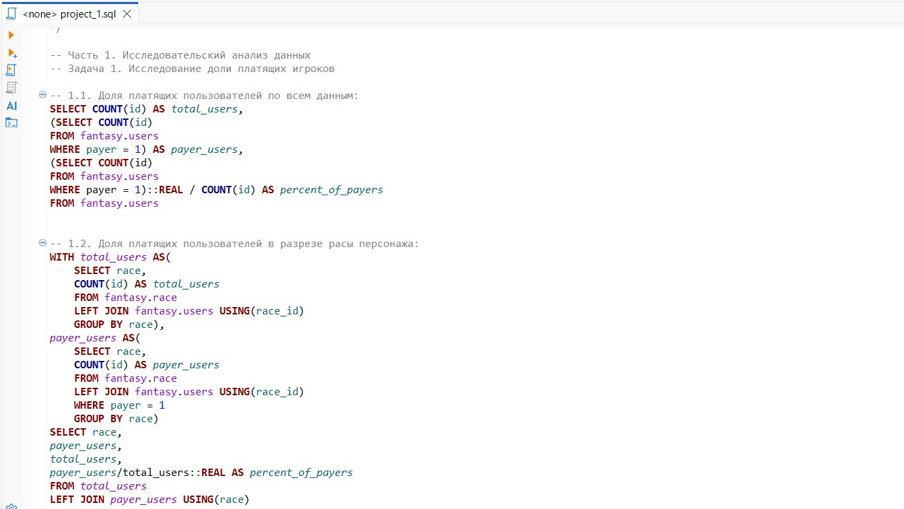

# Проект Анализ данных игры "Секреты Темнолесья"
## Бизнес-контекст:
«Секреты Темнолесья» — это онлайн-игра, в которой каждый игрок следует по сюжету своего персонажа, выполняет задания и исследует огромный виртуальный мир. В начале игры пользователь выбирает расу героя. От расы зависит отношение к пользователю торговцев и других игроков, а также неигровых персонажей — тех, которые не контролируются игроками. Кроме того, игрок выбирает класс персонажа, у которого тоже есть свои особенности. Игрок также выбирает легендарную способность, которую нельзя изменить в процессе игры. 
В игре можно покупать и продавать разные вещи: оружие, доспехи, еду, магические предметы и амулеты. Для покупок используют внутриигровую валюту. Такой валюты в игре две:
- Обычные монеты, которые можно заработать при прохождении игры. Они позволяют покупать обычные предметы.
- Валюта «райские лепестки», за которую можно покупать эпические предметы. Такие предметы дают преимущество при прохождении игры. «Райские лепестки» можно получить за прохождение сложных квестов или купить за реальные деньги. Покупать эпические предметы можно у других игроков, торговцев и внутри игрового приложения.

Разработчики утверждают, что игру можно пройти полностью без использования валюты «райские лепестки» и это опциональный способ ускорить прохождение. Однако для компании разработчика важно привлекать платящих игроков — тех, кто готов покупать внутриигровую валюту за реальные деньги.
Продажа «райских лепестков» — это основная часть дохода команды разработки. Команда игры планирует привлекать платящих игроков и продвигать покупку эпических предметов с помощью рекламы. 
## Цель проекта 
Изучить влияние характеристик игроков и их игровых персонажей на покупку внутриигровой валюты «райские лепестки», а также оценить активность игроков при совершении внутриигровых покупок.
## Структура проекта:
- исследовательский анализ данных
- решение ad hoc задач от коллег из маркетинговой команды игры «Секреты Темнолесья»
- выводы и аналитические комментарии

Основной инструмент - `sql`.

